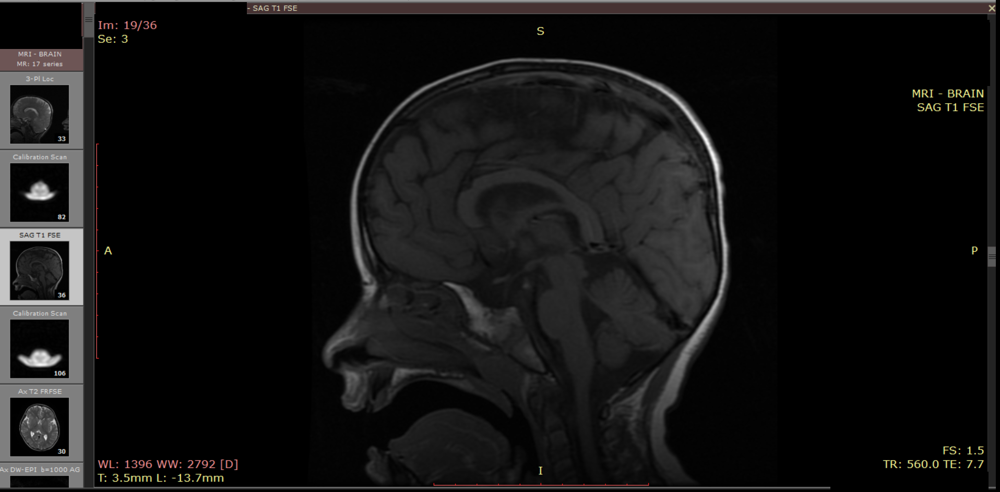

# Pateint_1000

## Main Symptoms
- 7q11.23 Duplication Syndrome.
- Autism
- More details in: 

## Blood Tests
- All blood tests from age 0 to 6.2 can be found here: 
## Hair Metals Test
- 

## Urine Test
- 
- High levels of Glyphosate were found

## Brain MRI:
- Link to MRI images: https://drive.google.com/open?id=1D7sGSed6d45Z9WaWbtl3MqXl_Kjv-qTe
- Done at age 6 and 4 months.
- Protocols: T2(FLAIR+FSE+SWI) , T1(FLAIR) , DWI, MRS TE=35
- Findings: 1. Normal brain scan. 2. Thicker mucos in the paranasal sinuses.
- Sample image from the scan: 

  

