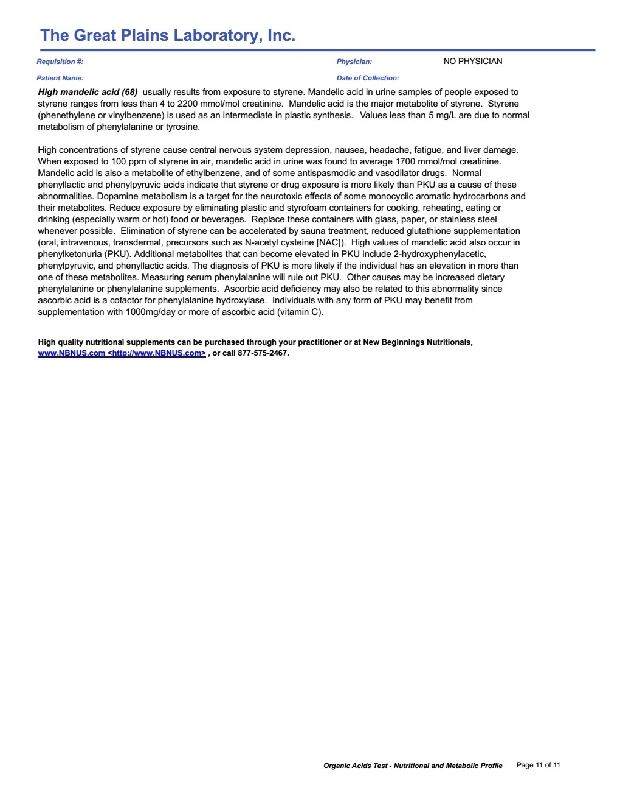

The test was done at age 6 and 2 months.
The test includes Organic Acid Test (OAT) and Glyphosate test
The most significant finding was high levels of Glyphosate.
The test was taken after several months of GAPS diet.

The test was done at age 6 and 2 months

